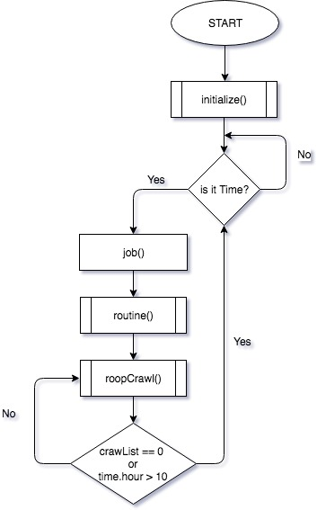
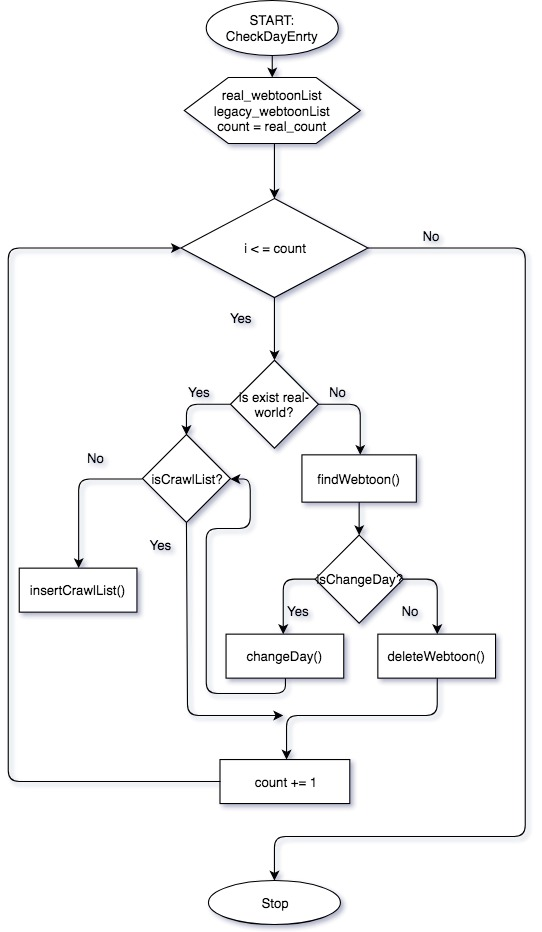
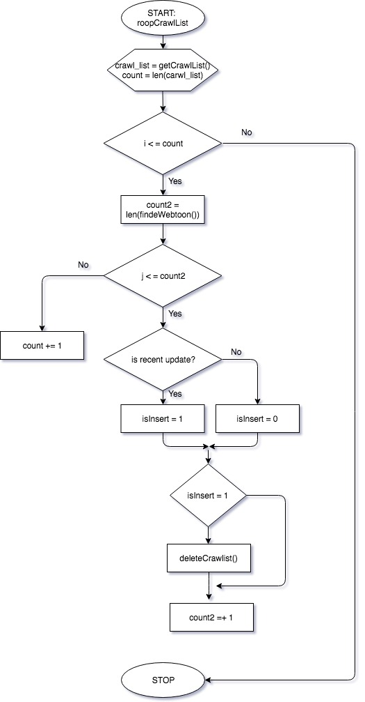

# Crawler
> "네\*버, 다*, 레* 등 웹툰 플랫폼 크롤링"


## About

Intercomcis App에 활용할 웹툰 데이터들을 수집합니다. 매일 특정시간에 크롤링을하며 최소한의 접근으로 많은 데이터를 가져오도록 구현하였고, 여러 플랫폼을 같은 워크플로우로 여러 플랫폼을 크롤하고 데이터베이스와의 무결성 및 알림등을 처리하기 위하여 코드를 생성하였습니다.

- - - 

### Installation
Clone this project from the github repository.

```bash
$ git clone https://github.com/curious3856/inco-crawler
$ pip install pipenv
$ cd my_crawler
$ pipenv install --three
```

Install packages in directory using following command:
```bash
$ pipenv install
```

run:
```bash
$ pipenv install
$ pipenv run python Main.py
```

- - - 
## Environment & Stack

**1) Environment**
  - GCP
  - pip
  - pipenv
  
  <br>
  
**2) Stack**
 - python3
 - selenium
 - date, time
 - sqlArchemy
 - pyMysql
 - requests
 - boto3
 

- - -
## FlowChart

<h4> - Main</h4>

<p align="center">
  
</p>

<h4> - initialize() & routine() -CheckDayEntry</h4>

<p align="center">
  
</p>

<h4> - roopCrawlList</h4>

<p align="center">
  
</p>

<br>

- - - 

## Copyright
* 저작권법 허용
   * 단순 링크 - 사이트 대표 주소를 링크
   * 직접 링크 - 특정 게시물을 링크
* 저작권법 위반
   * 프레임 링크 - 저작물의 일부를 홈페이지에 표시  
   * 임베디드 링크 - 저작물 전체를 홈페이지에 표시.
